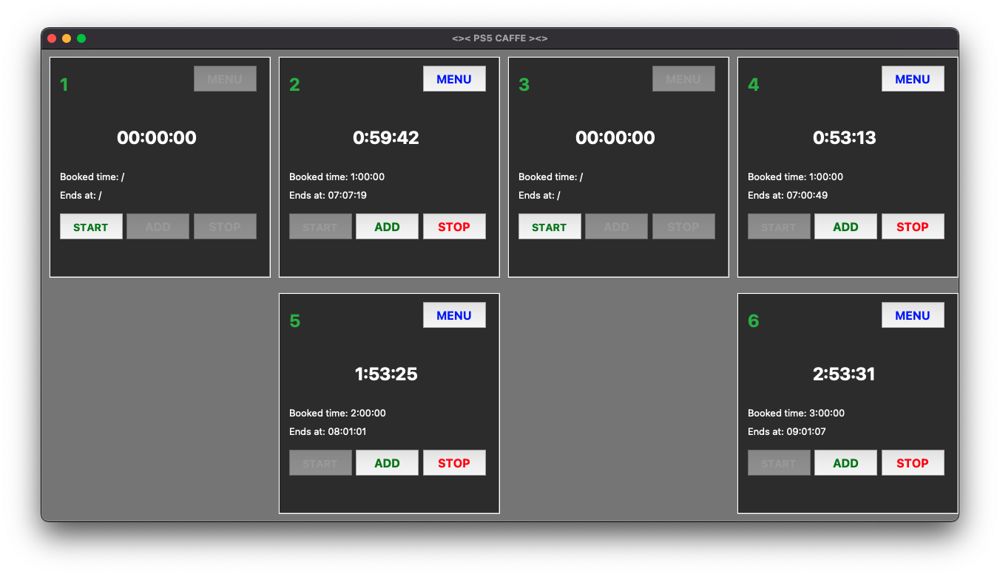

# ps5-console-caffe

## Simple GUI Python program based on tk/tcl for controlling smart TVs and PS5 consoles within LAN

### PoS software for e-sports console caffes

Software features:
- TV Time Management for customer sessions
- Drinks and snacks Menu
-  Each "booth" in caffe space represents one object on the screen
-  Open tab billing
-  Reporting system # TODO
-  2 User groups - admin, employees # TODO
-  Database viewing
-  Visualizations # TODO

dependencies:
  tkinter  
  tkcalendar  
  samsungtvws  

Structure:
  Object-oriented, one class instance represents one PS5 and TV as a whole -> one controlling unit on monitor

Snapshots:
  
  

